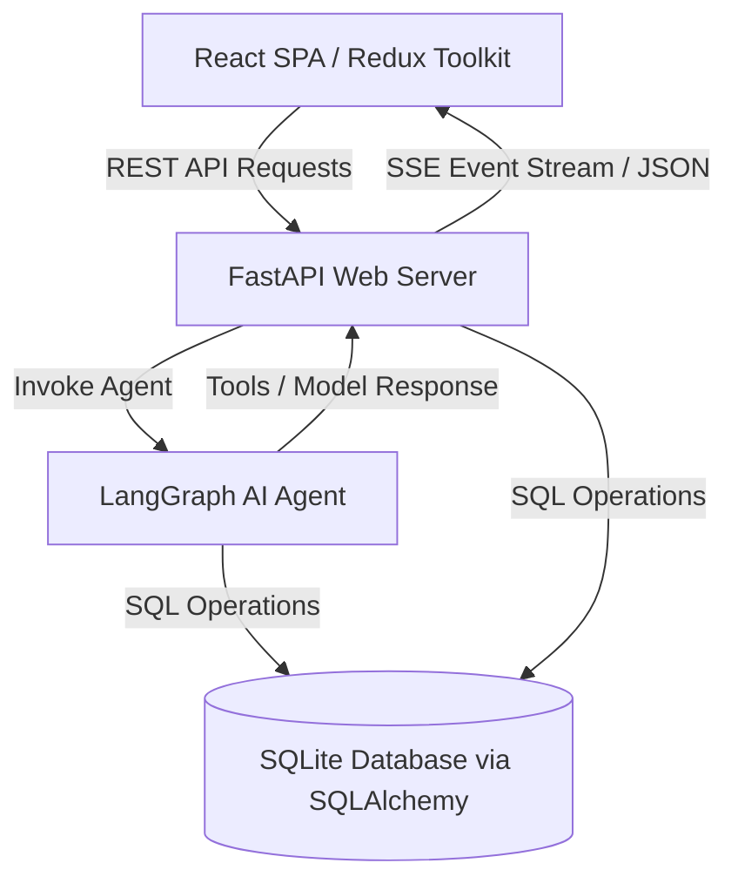

# Aegis CRM - AI-First HCP Module (Log Interaction Screen)

A state-of-the-art, AI-first Customer Relationship Management (CRM) module for Healthcare Professional (HCP) management, designed with a premium, responsive split-screen layout.

The **left panel** features a structured medical sales logging form, and the **right panel** hosts an interactive **AI Assistant** powered by **LangGraph** and **LangChain** for conversational log creation.

---

## 🏛️ System Architecture & Data Flow

The application is built using a decoupled client-server architecture:



1. **Frontend**: React SPA powered by Redux Toolkit for state management, styling with custom vanilla CSS variables (premium Slate-Zinc theme with glassmorphic accents), and Lucide React icons.
2. **Backend**: FastAPI web server exposing REST endpoints for form submissions and SSE (Server-Sent Events) for real-time chat token streaming.
3. **AI Agent**: Built with **LangGraph**, using a stateful cyclic graph that integrates tools with a Gemma/Llama model on Groq.
4. **Database**: SQLite with SQLAlchemy ORM representing HCPs, clinical Materials, Samples, and Logged Interactions.

---

## 🌟 Key Features

*   **Dual Mode Logging**: Log doctor visits seamlessly via a structured form or natural conversation.
*   **Real-time Streaming**: Chat responses are streamed token-by-token using FastAPI Server-Sent Events (SSE).
*   **In-Memory Session Checkpoint (`MemorySaver`)**: Utilizes LangGraph's MemorySaver to persist user conversation threads, allowing the representative to correct mistakes or add details dynamically.
*   **Dynamic HCP Registration**: If the logged doctor's name is not found in the database, the form automatically displays fields for **Specialty**, **Clinic**, **Email**, and **Preferences** to register their profile. All fields are optional.
*   **Format Normalization**: Automatically converts relative dates (e.g., *"yesterday"*, *"today"*) and times (e.g., *"10 PM"*) into browser-compatible HTML5 formats (`YYYY-MM-DD` and `HH:MM`).
*   **Directory Sorting**: Newly registered HCPs are ordered by ID descending, ensuring they appear **first** in the directory list.
*   **Timeline Logs**: Fully serializes and renders Materials Shared and Samples Distributed inside the timeline cards in a dedicated logs history tab.

---

## 🤖 The Five (5) LangGraph Tools

The LangGraph agent utilizes 5 custom tools (defined in `backend/tools.py`) to manage sales-representative actions:

1.  **`log_interaction_details`**: Captures multiple visit details (such as doctor name, attendees, topics, sentiment) and pre-fills the form. Supports custom HCP details (specialty, clinic, email, preferences) if registering a new doctor.
2.  **`edit_interaction_details`**: Performs targeted field-by-field updates (including profile details) when the user corrects a mistake or updates a single field.
3.  **`get_hcp_profile`**: Fetches the doctor's contact number, clinic, specialty, clinical preferences, and past visit logs from the database.
4.  **`suggest_follow_up`**: Recommends clinical follow-up activities and outcomes based on the discussion topics and sentiment.
5.  **`fetch_product_materials`**: Searches the approved brochures, clinical study sheets, and trial samples repository.

---

## 🚀 How to Set Up and Run

### Prerequisites
- **Python 3.9+** and **Node.js 18+** installed on your system.

### 1. Backend Setup
1.  Navigate to the `backend/` directory:
    ```bash
    cd backend
    ```
2.  Install the Python dependencies:
    ```bash
    pip install -r requirements.txt
    ```
3.  Configure environment variables in the [backend/.env](file:///e:/AI-First-CRM-HCP-Module/backend/.env) file:
    ```env
    GROQ_API_KEY=gsk_your_actual_groq_key_here
    GROQ_MODEL=gemma2-9b-it
    ```
4.  Start the FastAPI server:
    ```bash
    python main.py
    ```
    > [!NOTE]
    > On server startup, the database is automatically created and seeded with Indian HCP names (Dr. Amit Sharma, Dr. Priya Patel, etc.), clinical brochures, past interactions, and sample kits.

### 2. Frontend Setup
1.  Navigate to the `frontend/` directory:
    ```bash
    cd frontend
    ```
2.  Install the Node packages:
    ```bash
    npm install
    ```
3.  Start the Vite development server:
    ```bash
    npm run dev
    ```
4.  Open your browser and navigate to `http://localhost:5173`.

---

## 🧪 Verification & Usage Flows

Type natural language inputs in the chat screen or use suggestion chips:

1.  **Search Materials**:
    *   *Prompt*: *"Search for brochures related to Prodo"*
    *   *Result*: Displays list of matched PDFs and starter kits.
2.  **HCP Lookup**:
    *   *Prompt*: *"Show me Dr. Amit Sharma's preferences"*
    *   *Result*: Lists contact, clinic, preferences, and details. Prefills the form with Dr. Sharma's name.
3.  **Log Interaction (with Custom HCP Details)**:
    *   *Prompt*: *"Today I met with a new doctor named Dr. Harish Patel. His specialty is Oncology, clinic is City Cancer Center, and email is harish.patel@citycancer.org. We had a positive discussion about efficacy. I shared the Prodo-X Clinical Trial Summary brochure."*
    *   *Result*: Populates form fields and expands optional HCP registration inputs with specialty, clinic, and email. Normalizes date and time formats.
4.  **Edit Form Fields**:
    *   *Prompt*: *"Actually, change the sentiment to Neutral and set the time to 2:30 PM."*
    *   *Result*: Modifies the active form state immediately.
5.  **Generate Follow-ups**:
    *   *Prompt*: *"Suggest follow-up activities"*
    *   *Result*: Prefills outcomes and follow-up steps.
