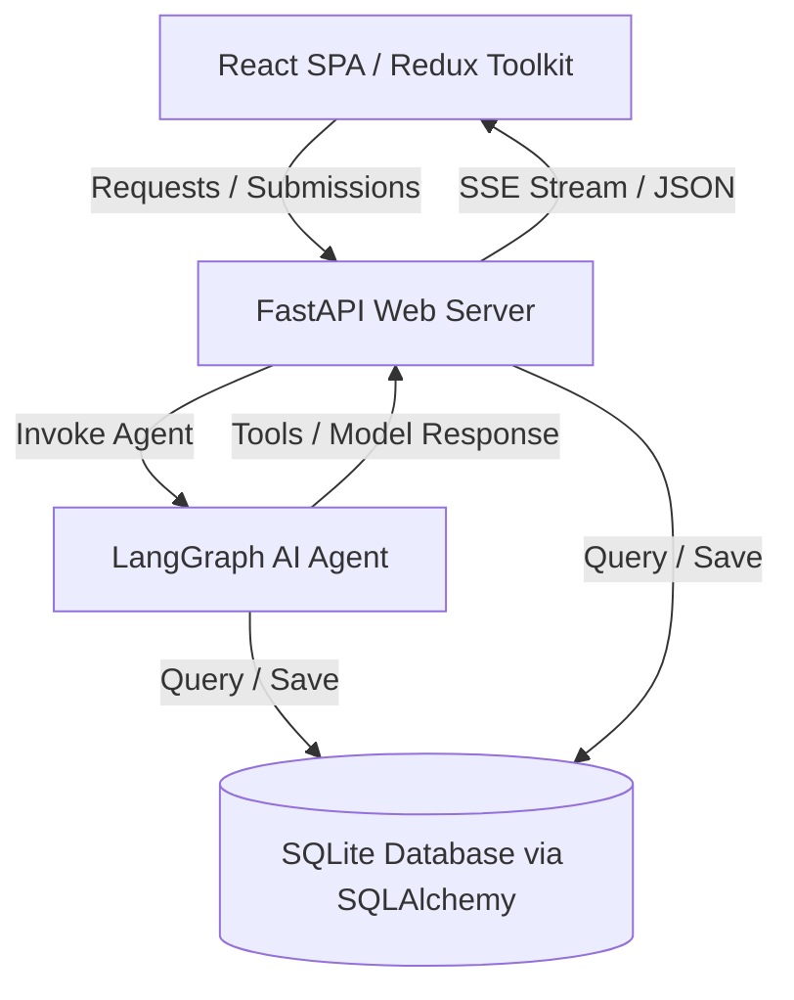
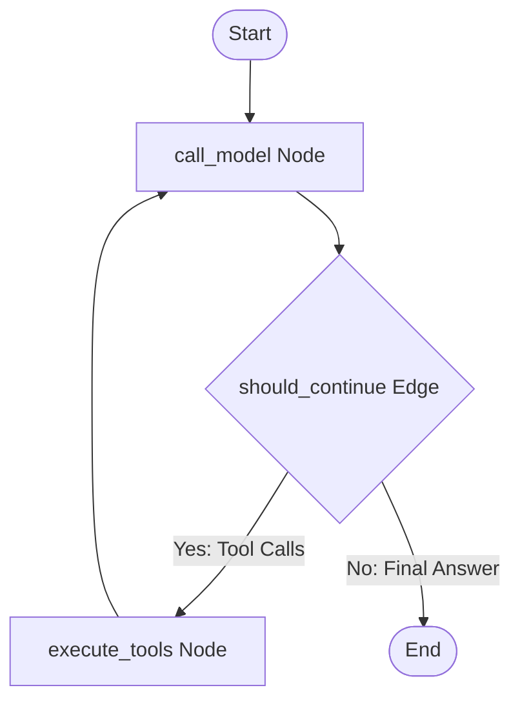

# Aegis CRM - AI Agent Architecture & Flow Documentation

This document explains the technical architecture, data model, LangGraph agent nodes, state routing, and streaming pipeline of the Aegis CRM application.

---

## 🏛️ System Overview

The application is built using a decoupled client-server architecture:

1. **Frontend**: React SPA powered by Redux Toolkit for state management, styling with custom vanilla CSS variables (premium Slate-Zinc light theme), and icons from `lucide-react`.
2. **Backend**: FastAPI web server exposing REST endpoints for form submissions and SSE (Server-Sent Events) for real-time chat streaming.
3. **AI Agent**: Built with **LangGraph**, using a stateful cyclic graph that integrates tools with a Gemini model.
4. **Database**: SQLite with SQLAlchemy ORM representing Healthcare Professionals (HCPs), Materials, Samples, and Logged Interactions.

---

## 🤖 LangGraph Agent Lifecycle & Flow

The agent runs as a stateful graph utilizing conditional routing and checkpoint memory.

### 1. State Definition
The graph state is defined in `backend/agent.py` as `AgentState`:
- `messages`: A list of messages (User, AI, System, Tool) capturing the conversational context.
- `form_state`: A key-value dict representing the current values of the representative's logging form.
- `tool_logs`: A list of logged actions executed by the agent's tools (rendered in the UI under the chat bubble).

### 2. Graph Nodes

#### A. `call_model` Node
- **Inputs**: The current `AgentState`.
- **Action**: Constructs a developer system instruction block containing:
  - Guidelines on CRM behavior.
  - The current state of the logging form (`form_state`).
  - Rules for updating fields.
- Calls the Gemini model bound with the available tools.
- **Output**: Appends the LLM's generated `AIMessage` to the state.

#### B. `execute_tools` Node
- **Inputs**: The current `AgentState`.
- **Action**: Iterates over the tool calls requested in the last `AIMessage`.
- For each tool call, it executes the corresponding function from `backend/tools.py`.
- Merges any `form_updates` returned by the tools into the state's `form_state`.
- Appends `ToolMessage`s containing the tool execution outputs.
- **Output**: Returns the updated `form_state`, `messages`, and `tool_logs`.

---

## 🛠️ System Tools & Conversational Logic

The agent has access to 5 system tools defined in [tools.py](file:///e:/AI-First-CRM-HCP-Module/backend/tools.py):

| Tool Name | Description | Match Logic | Conversational Instruction |
| :--- | :--- | :--- | :--- |
| `get_hcp_profile` | Retrieves database information for a specific doctor. | Fuzzy matching with `find_hcp`. | Returns full details or warns if missing. |
| `log_interaction_details` | Prefills multiple fields on the interaction logging form and optionally pre-fills HCP details (specialty, clinic, email, preferences). | Fuzzy matches HCP, materials, samples, and resolves details. | **Enriched**: Prompts LLM to inform user if doctor already exists, preventing duplicates, and asks for updates. |
| `edit_interaction_details` | Updates a single field on the active form (including specialty, clinic, email, and preferences). | Direct key-value mapping with dynamic lookups. | **Enriched**: Guides LLM to flag if the changed HCP matches an existing profile. |
| `suggest_follow_up` | Recommends outcomes and follow-up steps. | Rule-based semantic keyword generation. | Prefills next-step text fields on the form. |
| `fetch_product_materials` | Searches approved clinical materials or samples. | Case-insensitive substring matching. | Returns tables of pdfs and trial kits. |

---

## 🔄 Stateful Streaming Pipeline

To provide a smooth user experience, responses are streamed token-by-token:

1. **Request**: The client posts the message, history, and current form state to `/api/chat`.
2. **Execution**: The server starts the LangGraph workflow using `agent.astream_events(..., version="v2")`.
3. **SSE Streams**:
   - Tool execution status chunks are yielded as `{"type": "tool_logs", "content": "..."}`.
   - Live AI response tokens are yielded as `{"type": "token", "content": "..."}`.
4. **Stateful Stream Parser**:
   - The stream generator in [main.py](file:///e:/AI-First-CRM-HCP-Module/backend/main.py) uses a rolling token buffer to swallow the thought blocks and formatting tags (like `[RESPONSE]`, `[/RESPONSE]`).
   - Ensures raw developer tags are stripped and short messages (like `"hi"`) are cleanly flushed without freezing.
